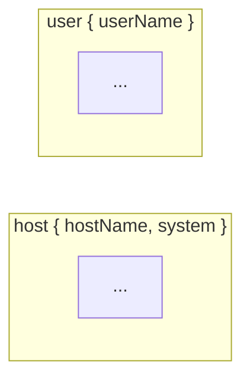
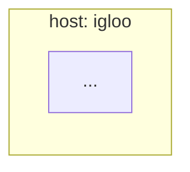

# Mermaid 渲染器

**源文件**: `nix/lib/diag/mermaid.nix`

## 概述

将格式无关的图 IR 渲染为 Mermaid 流程图字符串。支持 YAML 前置元数据（frontmatter），所有颜色来自主题记录。

______________________________________________________________________

## toMermaidWith — 带配置的 Mermaid 渲染

**签名**: `({ theme?, mermaidConfig? }) → (graph: graphIR) → string`

### 参数说明

| 参数 | 类型 | 默认值 | 说明 |
|------|------|--------|------|
| `theme` | `theme` | `themes.defaultTheme` | Base16 派生主题 |
| `mermaidConfig` | `attrset` | `{}` | 额外 Mermaid 配置 |

### 使用示例

```nix
# 基础用法
mermaidString = diag.toMermaidWith {
  inherit theme;
} graph;

# 使用 ELK 布局（密集流程图优化）
mermaidString = diag.toMermaidWith {
  inherit theme;
  mermaidConfig = {
    layout = "elk";
    elk = {
      mergeEdges = true;
      nodePlacementStrategy = "LINEAR_SEGMENTS";
    };
  };
} graph;

# 使用力导向布局
mermaidString = diag.toMermaidWith {
  inherit theme;
  mermaidConfig.layout = "cose-bilkent";
} graph;
```

______________________________________________________________________

## toMermaid — 默认配置的 Mermaid 渲染

**签名**: `(graph: graphIR) → string`

简便调用，使用默认主题和空配置：

```nix
mermaidString = diag.toMermaid graph;
```

相当于 `diag.toMermaidWith {} graph`。

______________________________________________________________________

## 输出特点

### 节点形状

- 普通节点：`["label"]`
- 参数化方面（六边形）：`{{"label"}}`
- 提供者方面（梯形）：`[/"label"\]`

### 边样式

| 类型 | Mermaid 箭头 |
|------|-------------|
| `normal` | `-->` |
| `excluded` | `-.-x` |
| `replaced` | `-.->|replaced|` |
| `provide` | `-.->|<label>|` |
| `policy` | `-.->|dispatches|` |

### 实体类型子图

当图包含实体类型时，节点按实体类型分组为子图：



### 实体实例子图

当图包含实体实例时，节点按实例分组：



______________________________________________________________________

## 节点颜色

每个节点拥有独立的 CSS 类定义。颜色来自 `visualFor` 函数（主题渲染工具）：

- 排除/替换节点：使用节点原有强调色 + 虚线边框
- 适配器节点：加粗边框
- 终端节点：细虚线边框
- 策略节点：长虚线边框
- 无类节点：细虚线边框

______________________________________________________________________

## 关联

- **`dot.nix`**: Graphviz DOT 渲染器（相同 IR 的不同输出）
- **`plantuml.nix`**: PlantUML 渲染器
- **`render-util.nix`**: 共享渲染工具（`renderMermaid`、`visualFor`）
- **`themes.nix`**: 主题定义
