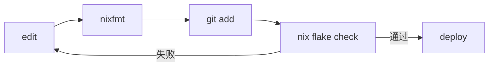

# PRD1: Pi Coding Agent 提示词全面优化

## Objective

对现有 pi coding agent 配置进行全面优化，使其：

1. **充分利用所有 pi 能力** — 让 agent 在正确时机主动调用 MCP、context-mode、subagents、pi-lens 等已安装工具
1. **优化 Nix 工作流表现** — 针对 Nix flake + Den 框架的日常开发流程，提供精准的工具选择和验证策略
1. **提升提示词质量** — 从"工具列表参考"升级为"决策驱动的工作指南"

### 目标用户

- 开发者 `xiaot_evo`，日常使用 Nix flake（Den 框架）管理系统配置
- 使用 opencode provider + deepseek-v4-flash-free（默认）+ deepseek-v4-pro（备用）
- 工作流包括：新增 feature aspect、修改主机配置、调试 nix flake check、更新 flake 输入

### 成功标准

- [ ] AGENTS.md 从"参考手册"升级为"决策驱动的 agent 工作指南"
- [ ] Context 提示词包含具体的工具选择策略，指导 agent 何时用 MCP vs grep vs skills
- [ ] Compaction 配置优化到合理值（keepRecentTokens: 32000）
- [ ] 模型快速切换列表已配置（deepseek-v4\*）
- [ ] `.pi/settings.json` 通过 Nix 声明式部署
- [ ] MCP 调用在 AGENTS.md 中有优先级指南
- [ ] 修改后 `nix flake check` 通过验证

______________________________________________________________________

## Related Specs

- 无前置 PRD。本 PRD 是 pi-coding-agent aspect 的首次规格文档。

______________________________________________________________________

## Tech Stack

| 项目 | 版本/来源 |
| --------------- | ---------------------------------------------------------------------------------------------------------------------------------------------------------------------------------------------------------------------------- |
| pi-coding-agent | `github:numtide/llm-agents.nix` 提供的包 |
| 运行时 | nodejs、python3（extraPackages） |
| 提供商 | opencode（DeepSeek V4） |
| 默认模型 | deepseek-v4-flash-free（200K 上下文） |
| 备用模型 | deepseek-v4-pro（1M 上下文） |
| 框架 | Den（`github:denful/den`） |
| 域名 | NixOS + Home Manager |
| 安装的 npm 包 | 11 个（context-mode, pi-web-access, pi-mcp-adapter, pi-powerline-footer, pi-lens, @chankov/agent-skills, @tintinweb/pi-subagents, @ayulab/pi-rewind, cc-safety-net, @lynskylate/agent-md-management, @juicesharp/rpiv-todo） |
| TS 扩展 | notify.ts, pi-permission-system, pi-rtk-optimizer |

______________________________________________________________________

## Commands

### 验证命令

```bash
# CI 门禁 — 修改后务必运行
nix flake check                                        # 检查所有 Nix 文件
nix run .#write-flake                                  # 重新生成 flake.nix
git add modules/features/dev/editors/pi-coding-agent/  # 新增/删除文件后

# 部署到主机
nix run .#acer-swift -- switch                          # 部署配置
```

### Pi 相关命令

```bash
pi -r                                                    # 恢复最近会话
pi --model opencode/deepseek-v4-pro --thinking high     # 用付费模型处理复杂任务
pi --model opencode/deepseek-v4-flash-free              # 默认模型
```

______________________________________________________________________

## Project Structure

### 需修改的文件

```
AGENTS.md                                              # [重写] 项目根目录 — 单一起源参考文档
modules/features/dev/editors/pi-coding-agent/
├── _packages.nix                                      # [修改] context 字符串、compaction、enabledModels
├── _home-files.nix                                     # [修改] 添加 .pi/settings.json 声明
├── pi-coding-agent.nix                                 # [不改] den aspect 定义
└── docs/
    ├── usage-guide.md                                  # [不改] 用户使用教程
    └── plugins-overview.md                             # [不改] 插件概览（或后续更新）
```

### 文件职责

| 文件 | 职责 |
| ------------------- | ------------------------------------------------------------ |
| `AGENTS.md` | agent 启动时自动加载的单一起源参考文档。**需重写为决策驱动** |
| `_packages.nix` | pi 的 packages 列表、context 提示词、模型和 compaction 配置 |
| `_home-files.nix` | 声明式部署 .pi/settings.json 等文件 |
| `.pi/settings.json` | 项目级 pi 设置（通过 Nix 部署） |

______________________________________________________________________

## Code Style

### AGENTS.md 风格

使用三级标题明确区分"规则"、"策略"和"参考"：

```markdown
## 全局原则

1. **规则**（必须遵守）：始终执行的硬约束
2. **策略**（决策指南）：推荐做法但可灵活变通
3. **参考**（按需查阅）：知识库信息，不强制加载
```

### Context 提示词风格

简洁但包含具体的工具选择指南：

```
## 工具选择策略

| 任务类型 | 首选工具 | 备选 |
|---------|---------|------|
| Nix 包/选项查询 | `mcp()` | `grep`/`find` |
| 代码理解 | `module_report` + `read_symbol` | `read` |
| 大文件分析 | `ctx_execute_file` | `read offset/limit` |
| 并行调研 | `Agent(Explore)` | 直接搜索 |
```

### Nix 代码风格

`_packages.nix` 中保持一致的属性顺序：

```nix
{ pkgs, ... }: {
  programs.pi-coding-agent = {
    enable = true;
    extraPackages = with pkgs; [ ... ];
    context = ''
      [提示词内容]
    '';
    settings = {
      # 1. 提供商和模型
      defaultProvider = "...";
      defaultModel = "...";
      # 2. 上下文管理
      compaction = { ... };
      # 3. 工具和包
      packages = [ ... ];
      # 4. 重试
      retry = { ... };
    };
  };
}
```

______________________________________________________________________

## Testing Strategy

### 验证层级

| 层级 | 命令 | 频次 | 说明 |
| ---------- | -------------------------------- | ---------- | --------------------- |
| 语法检查 | `nix-instantiate --parse <file>` | 每次编辑后 | 快速验证 Nix 语法 |
| Flake 检查 | `nix flake check` | 每次修改后 | CI 门禁，需先 git add |
| 部署验证 | `nix run .#acer-swift -- switch` | 最终确认 | 实际部署到主机 |

### 验证流程



### 测试关注点

- `.nix` 文件：`nix flake check` 确保评估通过
- `AGENTS.md`：纯 markdown，人工审查质量和完整性
- `.pi/settings.json`：通过 Nix 生成后检查 JSON 语法
- 实际效果：启动 pi 验证提示词生效，重启会话确认没问题

______________________________________________________________________

## Boundaries

### Always Do（始终做）

- 运行 `nixfmt <file>` 格式化每个修改的 `.nix` 文件
- 修改 `.nix` 文件后执行 `git add` 再 `nix flake check`
- AGENTS.md 中的每条规则都要有明确归属（规则/策略/参考）
- Context 提示词中的工具选择策略要对应实际安装的包
- 使用 `builtins.toJSON` 生成 JSON 内容（`_home-files.nix` 中部署 `.pi/settings.json`）
- 用 `ctx_execute` / `ctx_execute_file` 处理大输出，避免原始内容占用上下文

### Ask First（先问再改）

- 移除或替换现有 npm 包需先确认（功能重叠风险）
- 修改 pi-coding-agent.nix 的 aspect 结构需先确认（影响 den 框架兼容性）
- 大幅改变 AGENTS.md 的章节结构需先确认
- 添加需要系统二进制依赖的新包需先确认
- 更改 defaultProvider 或 defaultModel 需先确认

### Never Do（绝对不做）

- 不要在 AGENTS.md 中编造不存在的工具或包
- 不要使用 `pi install` 命令（所有配置通过 Nix 声明式管理）
- 不要移除 cc-safety-net（安全纵深防御）
- 不要在 AGENTS.md 中添加超过 30 行的大段未分节文本（progressive disclosure）
- 不要删除 git add 前运行 nix flake check 的步骤
- 不要混用 `---` 和 \`\`\`\` 分隔符导致 markdown 渲染异常

______________________________________________________________________

## Open Questions

- [ ] pi-rtk-optimizer（扩展）是否需要保留？RTK 输出压缩与 context-mode 功能是否有重叠？
- [ ] 当前 `pi-permission-system` 和 `cc-safety-net` 功能有重叠，是否保留两者？
- [ ] `superpowers-zh` 包是否也在使用？其提供的 20 个技能与 `@chankov/agent-skills` 的 27 个技能是否有冲突？

______________________________________________________________________

## 附录 A：当前配置清单

### 已安装的 npm 包（11 个）

| 包名 | 用途 | 来源 |
| --------------------------------- | ----------------------------------- | ----------------- |
| `pi-web-access` | 网页搜索与内容获取 | settings.packages |
| `context-mode` | FTS5 知识库 + 沙箱执行 + 上下文索引 | settings.packages |
| `pi-mcp-adapter` | MCP 协议适配器 | settings.packages |
| `pi-powerline-footer` | Powerline 风格状态栏 | settings.packages |
| `@juicesharp/rpiv-todo` | 跨压实任务管理 | settings.packages |
| `@tintinweb/pi-subagents` | Agent 工具 + FleetView 导航 | settings.packages |
| `pi-lens` | LSP 诊断 + AST 搜索 + 模块报告 | settings.packages |
| `@chankov/agent-skills` | 27 个工程化技能 | settings.packages |
| `@ayulab/pi-rewind` | 检查点导航与回滚 | settings.packages |
| `cc-safety-net` | 破坏性命令语义拦截 | settings.packages |
| `@lynskylate/agent-md-management` | AGENTS.md 审计与改进 | settings.packages |

### TS 扩展（3 个）

| 扩展 | 用途 |
| ----------- | ------------ |
| `notify.ts` | 终端桌面通知 |

### MCP 服务器

| 服务器 | 工具 | 用途 |
| ------- | --------------------------------- | ------------------------- |
| `nixos` | `nixos_nix`, `nixos_nix_versions` | Nix 包/选项查询、版本历史 |

### 当前配置详情

```nix
# _packages.nix 核心配置
defaultProvider = "opencode";
defaultModel = "deepseek-v4-flash-free";
defaultThinkingLevel = "high";
compaction = {
  enabled = true;
  keepRecentTokens = 100000;  # → 改为 32000
  reserveTokens = 16384;
};
retry.enabled = true;
retry.maxRetries = 3;
```

```nix
# 当前 context
context = ''
  请用中文回复。参考 AGENTS.md 了解项目结构、约定和完整技能表。
'';
```
